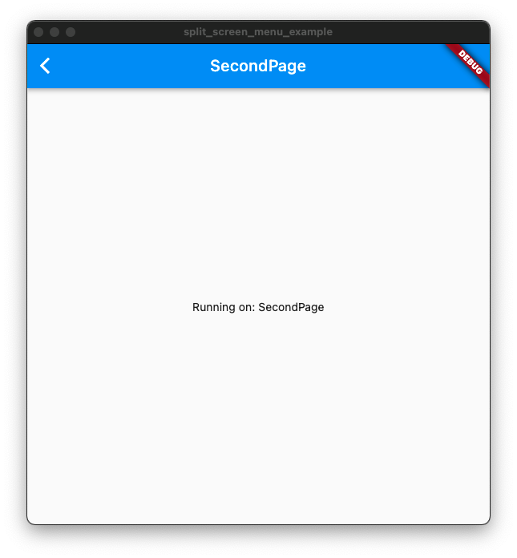

# split_screen_menu

A split-screen menu page

## Getting Started
- ### SplitScreenMenu
  - menu 
  - initialRoute
  - initPage
  - onGenerateRoute
- ###MenuNavigator
  - push
  - pushNamed
  - popAndPushNamed
- Use
  - Please refer to the example

## Screenshot

### Main

### Menu
- on Pad

- on Phone

### SecondPage
- on Pad

- on Phone
